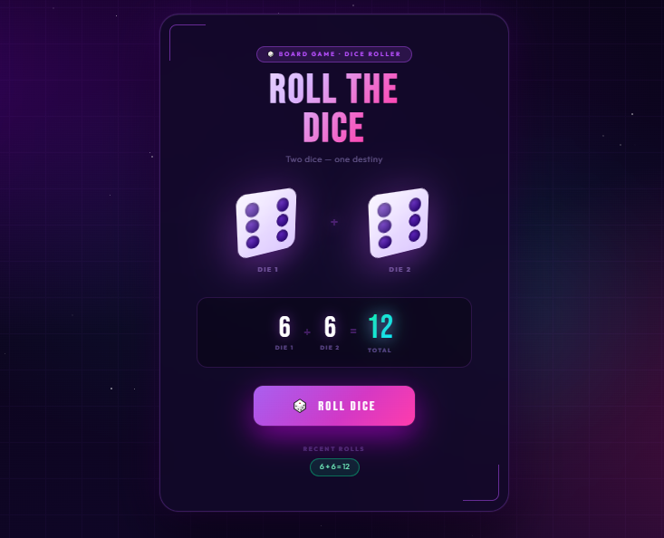

# 🎲 3D Dice Roller

A visually rich **3D Dice Roller Web Application** built using **HTML, CSS, and JavaScript**.
The application simulates rolling **two 3D animated dice** and calculates their **sum dynamically** with engaging UI effects.

The project features smooth animations, glowing neon UI, roll history tracking, confetti effects, and interactive visuals.

---

## 🚀 Live Demo

👉 Try the Dice Roller here:

https://hemavati07.github.io/Rolling-Dice/
---

## 📸 Screenshot




---

## ✨ Features

* 🎲 **3D Dice Animation**
* 🔢 **Automatic Sum Calculation**
* 🎨 **Modern Neon UI Design**
* 🌌 **Animated Background with Floating Orbs & Stars**
* 🎉 **Confetti Burst Effect on Roll**
* 📊 **Recent Rolls History**
* ⚡ **Smooth CSS Animations**
* 🔔 **Special Messages for Lucky Rolls**

  * Snake Eyes (2)
  * Lucky Seven (7)
  * Eleven
  * Boxcars (12)

---

## 🛠️ Technologies Used

* **HTML5** – Structure
* **CSS3** – Styling & Animations
* **JavaScript** – Logic & Interactivity

---

## 📂 Project Structure

```
dice-roller/
│
├── index.html        # Main project file
├── screenshot.png    # Project screenshot
└── README.md         # Project documentation
```

---


## 🎮 How It Works

1. Click the **ROLL DICE** button.
2. Both dice animate with a 3D rolling effect.
3. Random numbers between **1 and 6** are generated for each die.
4. The **sum of the dice** is calculated and displayed.
5. Special animations and messages appear for certain totals.

---

## 📌 Future Improvements

* Add **sound effects for dice rolling**
* Add **multiplayer dice rolling**
* Add **statistics and probability charts**
* Mobile-optimized interactions
* Dark/Light theme toggle
